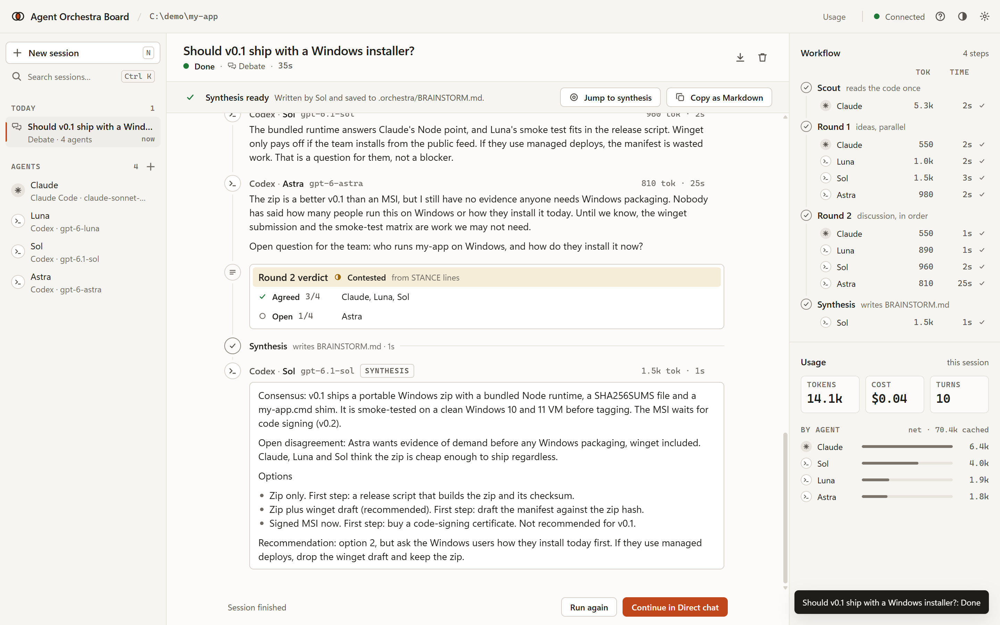

# Agent Orchestra Board

**A local web board where Claude Code and Codex CLI agents debate a plan, propose and review each other's work, build a plan item by item, and show you every step live.**

[](https://github.com/canerganis/agent-orchestra-board/actions/workflows/ci.yml)
[](LICENSE)
[](package.json)

Zero dependencies, runs on your own CLI logins (no API keys). Agents only read your project, except in a Workflow build, where they work inside per-item git worktrees and you apply each reviewed change yourself.

<p align="center">
  
</p>
<p align="center"><sub>A finished Council (called Debate in v0.1): scout brief, two rounds, a round verdict from the agents' stance lines, the synthesis, and the live workflow timeline with tokens per turn.</sub></p>

## What you get

* **Two vendors at one table.** A seat is either `claude -p` or `codex exec`. Put an Opus-class architect, a GPT-class reviewer and a devil's advocate into the same room.
* **Four modes.** Ask one model, hold a Council, run a Workflow (Plan → Approve → Build), and watch your Claude Code workflow runs in Runs (below).
* **A plan you approve before anything is built.** A manager seat writes a plan of items, each with a spec, owner paths, dependencies and a difficulty tier. You approve a revision by its hash. Nothing runs before that.
* **You pick who builds it.** The board's own team builds in git worktrees behind a write gate, or the board hands the plan to your own Claude Code or Codex and watches that run live.
* **Changes you can review before they land.** Board builds edit per-item worktrees, and you apply each reviewed item. It is staged, never committed.
* **A live workflow view.** A zero-dependency Node server streams each turn over SSE: who is thinking, writing or running a command, what it said, what it cost.
* **Cost you can see.** Every room shows net (uncached) vs cached tokens and the CLI-reported cost, and the board has experimental Claude and Codex usage-limit meters.
* **Token-lean by design.** Lean CLI flags, one shared scout brief, unseen-only transcripts, early stop. See [Token savings](#token-savings) for the numbers and their limits.
* **Local.** Binds `127.0.0.1`, session-token protected. Prompts and any code the agents read go to Anthropic and OpenAI through your CLIs, exactly as when you use them directly.

## Quick start

Try it first without any CLI or model call. The demo opens recorded rooms (a Council, a plan and a build waiting for you) in a temporary folder:

```sh
git clone https://github.com/canerganis/agent-orchestra-board.git
cd agent-orchestra-board
node bin/agent-orchestra-board.js demo --open
```

To use it on your own project:

Prerequisites: Node 20 or newer, and the [Claude Code CLI](https://docs.anthropic.com/en/docs/claude-code) and/or the [Codex CLI](https://github.com/openai/codex), logged in. One of the two is enough if all your seats use it. Builds also need `git` 2.25 or newer.

```sh
git clone https://github.com/canerganis/agent-orchestra-board.git
cd agent-orchestra-board
node bin/agent-orchestra-board.js /path/to/your/project --open
```

The terminal prints a URL like `http://localhost:4317/?t=...`. Open that one (or pass `--open`); the token in it is exchanged for a session cookie on first load.

`npx agent-orchestra-board` will work once the package is published to npm. It is **not published yet**, so use the clone above. Do not run `npx orchestra-board`: that name belongs to an unrelated project. The command to type is `agent-orchestra-board` or `aob`.

```
node bin/agent-orchestra-board.js [projectDir] [--port <n>] [--open]   # projectDir defaults to the current directory
node bin/agent-orchestra-board.js doctor [projectDir] [--json]          # Node, CLIs and logins, Windows sandbox, port, state dir
node bin/agent-orchestra-board.js doctor --containment [--yes] [--json] # opt-in, real CLIs: see Safety and permissions
node bin/agent-orchestra-board.js --version | --help
```

`npm link` (or `npm i -g .`) in the clone puts `agent-orchestra-board` and the short alias `aob` on your `PATH`. Run `doctor` first if anything looks off: it only runs `claude --version` and `codex --version`, never a billable turn. A CLI you do not have installed shows up as a failed check, so with one CLI expect one red line.

The default team is one Claude seat and three Codex seats. With only one CLI installed, switch the other seats' *Runtime* (or delete them) before the first Council; the setup card in the UI names the affected seats. With no CLI installed, Home still shows the mode cards, disabled, each with its reason as text.

All project state lives in `<project>/.orchestra/` (`seats.json`, `rooms/`, `BRAINSTORM.md`, `LOG.md`, `session`, `proposals/`, `worktrees/`, `handoff/`, ...). **Never commit `session`**: it is the password to the board. The board writes a `.orchestra/.gitignore` that lists `session`, `worktrees/` and the rest it must keep out of git. Write check records are kept per user, outside every project (see [Safety and permissions](#safety-and-permissions)).

## Four modes

The sidebar has four modes. Keys `1` to `4` switch between them, and `N` starts something new in the current one.

| Mode | What happens |
| --- | --- |
| **Ask** | Talk to one model. Pick it from a list (model id, vendor, seat). Switch the model any time; the new one gets a short recap of the conversation in its first prompt, with no extra call. Ask turns never edit files. Legacy Direct chats show up here as "Chat with ... (agent memory)". |
| **Council** | Several models debate your question, then one writes a synthesis. An optional read-only **scout** writes a shared brief with `file:line` references. Round 1: every seat gives independent ideas in parallel. Later rounds: each seat sees only the messages it has not seen. Stops early when every seat ends with `STANCE: CONVERGED`. The **facilitator** synthesis is appended to `.orchestra/BRAINSTORM.md`. No files change. With only one vendor installed, a Council is one model family arguing with itself, and the intro says so. A finished Council can be turned into a Workflow: the plan starts from its synthesis and skips the plan debate. |
| **Workflow** | Plan → Approve → Build (below), and *Single task review*, the Propose → Review loop: a builder proposes in text and a reviewer answers with BLOCKER / SHOULD-FIX / NIT findings and `VERDICT: PASS` or `FAIL`; on `FAIL` the builder goes again. |
| **Runs** (experimental) | Lists the Claude Code Workflow runs of this project, or of every project, live and read only. The board never starts or stops them. See [Runs](#runs-experimental). |

You can interject in a running Council or review at any time; the next speaker reads it. Seats that have nothing new to add are skipped ("agreed silently").

Round limits: the New session form offers 1 to 4 Council rounds and 1 to 3 Propose → Review rounds (both default 2). The API accepts 1 to 5 and 1 to 6. A plan's manager gets at most two turns (one repair). A build's item rounds are set in the Start build dialog; the API accepts 1 to 6, default 3.

## Workflow: Plan → Approve → Build

A plan is a list of items. Each item has a spec, the paths it may change, the items it depends on and a difficulty tier. The manager writes the plan, you approve it, and then you choose who builds it.

1. **Plan.** *New workflow*: pick a manager (it writes the plan), optional debate participants and the goal. Review the items, owner paths, dependencies and tiers. Use *Edit* to change the plan, then *Approve*. Nothing is built before approval. The plan card shows *Before you build*: whether the project is a git repository with a commit, uncommitted changes, and which CLIs may edit files.
2. **Start build.** On the approved plan, *Start build* asks who builds it.

| Engine | Where the work happens | Write gate |
| --- | --- | --- |
| **Board team** (default) | The board runs each item as Propose → Review on your seats. A manager, hard, medium, easy and reviewer role map to agents; a role without an agent falls back along a fixed chain. In write mode each item edits its own git worktree under `.orchestra/worktrees/`, and you apply each item. | Inside it |
| **Claude Code, you run it** | External. The board writes a handoff file under `.orchestra/handoff/` and gives you a prompt to paste into your own Claude Code, which runs the plan as a Workflow. The board finds the run by its code, links it after one click, mirrors its agents live and shows what changed when it ends. | Outside it |
| **Codex, you run it** | External, the same flow: you run the plan with Codex sub-agents, and the board follows them through `~/.codex/sessions`, showing each sub-agent's sandbox (a "full access !" sandbox is flagged). | Outside it |

**External** means the run happens in your own CLI, with your own settings, outside the board's write gate. It can edit your checkout. The handoff asks it to work in a git worktree or on a new branch `ob/<code>` and to leave the changes uncommitted, but that is guidance, not a guard. The board never starts, stops or kills an external run, and it computes what changed with read-only git. The suggested models per difficulty are written into the handoff and are not enforced. Launching Codex runs from the board waits for v0.3 ([ADR 0007](docs/decisions/0007-engines.md)).

**Board team builds, step by step.**

1. **Check the project.** The folder must be the top level of a git repository with at least one commit. For a build that edits files the checkout must be clean: nothing staged, unstaged or untracked outside `.orchestra/`.
2. **Allow edits per agent.** In the agent editor, tick *May edit files in Build worktrees*. For a Claude seat the box is enabled only after Claude passed the write check: open *Settings* and press *Run write check* on the Claude Code card. The check runs one real turn of a seat in a throwaway repository, so it costs one turn. Run it again after upgrading the CLI. A Codex seat never edits files itself (see [Safety](#safety-and-permissions)). Ticked, it builds in patch mode: it runs read-only and returns a diff that the board checks and applies inside the item's worktree.
3. **Mode.** *Automatic* (the default) edits files when every builder may, and otherwise proposes. *Propose* never edits files: each passing item exports its diff as a patch file under `.orchestra/proposals/` with its sha256 and the `git apply` commands to copy. These patches are untested, so read them before you apply them.
4. **Apply.** When an item passes review, open its proposal and press *Apply*. The change is staged in your checkout. Check it with `git diff --cached`, then commit it yourself. *Discard* drops an item and blocks the items that depend on it.

Pause and Resume control the loop. A restart of the board does not resume a build by itself: press Resume. Deleting a build removes its worktrees and frozen proposals.

The statuses, preconditions and error codes are in [docs/api.md](docs/api.md#builds). The design is in [docs/ARCHITECTURE.md](docs/ARCHITECTURE.md#plan--approve--build).

## Runs (experimental)

Runs lists Claude Code Workflow runs: their phases, agents, models, statuses, tokens, tool counts and durations, updated live. Scope is *This project* or *All projects*, set in the Runs header. A run linked to a Workflow room says so and opens that room.

It is experimental because it reads Claude Code's own files, whose formats are undocumented and can change with any update. *What the board reads* in the Runs header lists them: under your Claude Code folder (`CLAUDE_CONFIG_DIR` or `~/.claude`), the working directory of each session transcript (to match it with the project), the workflow journals, each agent's meta file, the transcripts of running agents (usage, tool names, timestamps) and the run summaries. It opens nothing else and writes nothing. Prompt and result text are never stored: *Prompt* fetches a 400 character preview on demand, kept in the page's memory only. Nothing polls while Runs is closed and no run is linked. Runs needs no CLI, only the Claude Code folder.

## How it works

One Node process, no build step. Workflows call a runner that spawns `claude -p --output-format stream-json` or `codex exec --json` as a child process, parses the JSONL stream, and pushes events to the browser over SSE. Each room is a JSON file under `.orchestra/rooms/`. Threads are scoped per room, so a seat does not drag another meeting along. Build items work in detached git worktrees under `.orchestra/worktrees/`. External runs are followed by polling the CLIs' own files, read only. See [docs/ARCHITECTURE.md](docs/ARCHITECTURE.md) for the module map, a data-flow diagram, the turn lifecycle, the write gate and the security model, [docs/api.md](docs/api.md) for the HTTP and SSE contract, and [docs/decisions/](docs/decisions/README.md) for the decision records.

## Token savings

The levers, all on by default:

| Lever | Effect |
| --- | --- |
| Lean CLI launch (no user plugins, MCP servers, skills, hooks, slash commands, extra tool families) | Per-call baseline **36k -> 6.7k tokens** for Claude and 24k -> 15k for Codex, **on my setup, which has several MCP servers and skills**. These two figures are single observations that were not saved as raw captures, so they are not reproducible from this repository. A bare install will see a much smaller saving. |
| Tools only where needed | Claude seats get no tools in discussion rounds, synthesis and round 1 after a scout; the scout gets `Read`/`Grep`/`Glob`. A Codex seat always has a shell tool: in those turns it runs read-only in an empty folder and is told not to use it. That is an instruction, not an enforced limit. |
| One scout brief in its own thread | Files are read once, not once per seat. |
| Per-room threads and unseen-only transcripts | Each turn carries only the delta. |
| Early stop, silent agreement | Fewer turns (neither fired in the measured run, see below). |
| Effort cap (discussion rounds at `medium`) | Cheaper reasoning per turn. Added after the measured run, so it is **not** part of the measured figure. |

**What was measured:** the same 4-agent planning meeting (default seats: 1 Claude + 3 Codex, 2 rounds + synthesis, scout and facilitator among the four) ran once on the pre-redesign board and once on the token-lean board, 12 minutes apart. Total tokens went from **1,686,111 to 461,540 (73% fewer)**; the Claude-reported cost of the Claude turns went from $1.02 to $0.16.

**Read this before quoting it.** It is **one run per arm on one machine** (Windows 11, Claude Code 2.1.291, Codex CLI 0.160.0, 2026-10-07), not a benchmark. The "before" ran on older code that is not in this repository and also had bugs fixed later, so the difference mixes the token levers with other changes. "Total" means every input token the CLIs reported, cache reads included, plus output; it is the only figure both runs have, because the old board stored one undivided count per turn. The after run was 204,374 uncached + 257,166 cached. Early stop did not fire in either run, and the after run predates the effort cap (the Sol seat, Architect on Codex, still ran round 2 at `high`). Output quality was not measured. My impression is that the scout brief was the biggest saving, but the levers were not measured separately. The trade-off: only the scout reads code, so a shallow brief misleads every seat, and the `file:line` citations in later rounds are copied from it, not re-checked.

The raw rooms (sanitized) and a script that recomputes every number are in [docs/measurements/2026-10-07/](docs/measurements/2026-10-07/README.md). [bench/](bench/README.md) has a harness for a repeatable lean-vs-naive comparison (a second board started with `ORCHESTRA_NAIVE=1`, which reports `naive: true` in `GET /api/state`; see its README); no result from it has been published yet.


## Safety and permissions

Evidence from the first real containment run, and what it does and does not show, is in [SECURITY.md](SECURITY.md#containment-evidence).

* **Read-only except in board builds.** Ask, Council, Propose → Review, the plan manager and every reviewer run read turns only: Claude with `--tools Read Grep Glob --permission-mode dontAsk` (a tool outside the list is denied instead of prompting), Codex with `sandbox_mode=read-only`. Read-only is enforced by the vendors' CLIs, not by the board.
* **Codex writes only through patch mode, on every platform.** Direct Codex file writes are disabled in `src/platform.js`. Nobody has run the check on a real Mac or Linux machine, so no Codex turn gets write access, and no setting, flag, environment variable or seat field turns it on. A Codex seat with write permission builds in **patch mode**: its turn runs read-only and ends with a unified diff; the board checks the diff (owner paths only, no `.git` or `.orchestra`, no absolute or `..` paths, no symlinks or submodules) and applies it inside the item's worktree. A file that changes during that read-only turn quarantines the item.
* **Claude write seats have no shell and stay in their worktree.** A Claude write turn runs in its item's detached git worktree with `--tools Read Grep Glob Edit Write`, `--permission-mode acceptEdits`, no `--add-dir`, `--settings`, `--mcp-config`, `--plugin-dir` or `--agents`, and `--strict-mcp-config --setting-sources ""`. The board checks that argv before every write turn, and checks what the CLI reports at the start of the turn: any extra tool, a shell tool, another working directory, another permission mode or an MCP server stops the turn and turns Claude writes off for the session. A write turn resumes only a thread that was started in the same worktree. Before each write turn the board refuses a worktree that holds a symbolic link or junction, and it never trusts the worktree's own `.git` file.
* **Acceptance checks are off by default and unsandboxed.** A plan carries checks only when you turn them on for that plan. The approval screen lists every command verbatim; they run on this machine with your permissions, in the item worktree after the change is frozen, with a minimal environment (no tokens or keys) and a time limit, and the receipt records that they ran. The process tree is killed on exit, timeout or stop. On Windows, background processes a check starts may outlive it.
* **Writes need a passed write check.** A Claude write turn runs only after the write check has passed for that CLI on this machine. The check asks the CLI to write one file inside its worktree and two outside it, and passes only when the inside file exists, nothing escaped, and the CLI's own tool log shows it tried both outside writes and was refused. A check that cannot prove the attempts is *inconclusive* and leaves writes off.
* **Check records are per user, not per project.** They live in `%APPDATA%\agent-orchestra-board` on Windows, `~/Library/Application Support/agent-orchestra-board` on macOS and `~/.config/agent-orchestra-board` elsewhere, bound to the CLI version, the platform, the board's write flags, the CLI binary (path, size, modification time), the host and the user. Any change voids the record. A `.orchestra/capability.json` in a project is ignored.
* **How write mode is chosen.** The Start build dialog defaults to *Automatic*: a board build runs in write mode when every builder may write (a Claude write seat whose CLI passed the check, or a Codex write seat in patch mode), and in propose mode otherwise; the room says which and why. Giving a seat write permission and approving the plan is the explicit intent. Pick *Propose*, or give the builders read permission, to build without file edits.
* **The main checkout changes only through Apply.** Apply stages a reviewed change with `git apply --index`. The board never commits.
* **A guard watches the checkout.** Around each builder write turn the board fingerprints the main checkout, the other worktrees and the worktree's `.git` file. A change quarantines the item and turns writes off for that CLI. This detects; it does not prevent. [SECURITY.md](SECURITY.md#limits) lists what it does not see.
* **External runs are yours.** *Claude Code, you run it* and *Codex, you run it* run in your own CLI with your own settings, outside all of the above. The board only writes the handoff file, reads the run's files and shows what changed. On the development machine, 206 of 231 Codex sub-agents of past runs ran with full access, which is why the run card shows each sub-agent's sandbox.
* **`doctor --containment` is opt-in.** `agent-orchestra-board doctor --containment` prints a plan and does nothing more; with `--yes` it starts the real Claude and Codex CLIs on cheap models (`claude-haiku-5-5`, and `gpt-6-luna` at low effort), a few cents, in a temporary repository, and reports whether their sandboxes keep writes inside the worktree, including shell, `..` and absolute-path writes, and whether a read-only Codex seat can start sub-agents. Your project is not touched, it never writes a check record (the in-app write check stays the only way to turn writes on), it refuses to run under `CI` or `GITHUB_ACTIONS`, and plain `doctor` never runs it. It has not been run against the real CLIs for this release.
* **Never uses `--dangerously-skip-permissions`.** Claude write turns use `acceptEdits` instead, and the static check refuses any write argument list that contains a skip or bypass flag.
* **Localhost only.** The server binds `127.0.0.1`, accepts only local `Host` and `Origin` values (DNS-rebinding and cross-site protection), takes only validated `application/json` POSTs and sends a strict CSP.
* **Session token.** Each project gets a random token in `.orchestra/session` (mode 0600 on macOS and Linux; on Windows the file inherits the project folder's permissions, so keep the project under your user profile), exchanged for an `HttpOnly; SameSite=Strict` cookie and required on every `/api/*` request. A web page you happen to have open, or another local process, gets `401`. Do not expose the port through a tunnel or reverse proxy.
* **Targets stay inside the project** (resolved with `realpath`), and **the project never supplies the CLI**: every child process is resolved on `PATH` and started by absolute path, so an executable planted in a repository you point the board at is never run.
* **Costs are yours.** Turns run under your own logins and count against your plans, including the write check and every build turn. The *Refresh Claude usage* button makes one small Haiku call because that is the only way to read Claude's rate-limit window.
* **Not affiliated with Anthropic or OpenAI.** Claude and Claude Code are trademarks of Anthropic; Codex is a product of OpenAI; this project only drives the CLIs you installed.

The threat model and the limits are in [SECURITY.md](SECURITY.md) and [ARCHITECTURE.md](docs/ARCHITECTURE.md#security-model). The decision records are [ADR 0004](docs/decisions/0004-read-only-v0-1.md) (superseded in part), [ADR 0006](docs/decisions/0006-worktree-write-gate.md) and [ADR 0007](docs/decisions/0007-engines.md).

## Windows notes

Windows 11 is the primary development platform.

* **Use the native CLI installers.** The board spawns the CLIs without a shell, so the `claude.cmd` and `codex.cmd` shims that `npm i -g` creates do not work (Node cannot start a `.cmd` file). Use `claude.exe` and `codex.exe`, or set `ORCHESTRA_CLAUDE_BIN` or `ORCHESTRA_CODEX_BIN` to the full path of an `.exe`. `doctor` flags a `.cmd` shim, and the board team treats that CLI as broken.
* **Codex sandbox fix.** The Codex sandbox cannot launch the Microsoft Store `pwsh` alias under its restricted token, which fails with access denied. Codex children therefore run with `-c windows.sandbox="unelevated"` and a `PATH` without `WindowsApps`. `taskkill /T /F` stops a seat together with everything it spawned. Codex only writes through patch mode.
* macOS and Linux run the same code paths minus those two fixes. CI runs the test suite on Ubuntu, macOS and Windows (Node 20, 22, 24) against fake CLIs; real-CLI runs have only been done on Windows 11.

## Limitations

* Runs and the external engines read undocumented Claude Code and Codex files. They are tagged experimental, ignore unknown fields and fail soft, but a CLI update can break them.
* The board does not launch Claude Code or Codex runs. External engines are handoff and watch only; launching Codex runs from the board is planned for v0.3.
* A run is matched to its handoff by a code the agents are asked to use. A model may ignore it; *Find my run* then lists the runs that started since the handoff, scored by the plan items they name, and you pick one.
* Usage meters are experimental; both source formats are undocumented and may change.
* A server restart stops board turns in flight (use *Run again*). A build that was running waits for an explicit Resume.
* Write builds need a git repository with a commit and a clean checkout when they start, and Claude builders need a passed write check. Without them a build runs in propose mode.
* The write gate and the guard detect and gate; they do not prevent. They do not see ignored files, files outside the project, or changes that are undone before a turn ends. The write check is one prompt on one run.
* Claude's real start-of-turn tool list has not been checked against the strict startup rule with a real CLI for this release. If Claude reports more tools than the board asked for, every Claude write turn stops before it edits anything, until the list is reviewed.
* A build that quarantines an item ends with status `error` and cannot be resumed. Delete it, and start a new build once the write check passes again.
* The adapters parse `claude --output-format stream-json` and `codex exec --json`. Developed against Codex CLI 0.160.0 and Claude Code CLI 2.1.291 (2026-10-07). `doctor` only checks that each CLI starts and prints its version; it does not check the output format. After upgrading either CLI, send a short Ask message on each CLI you use: if the format changed, the failed message shows an "Unrecognised ... CLI output" error. The lean flags are covered by unit tests on the argument lists, not by a paid run in CI.
* One user, one project per board, no remote access, on purpose.

## FAQ

**Does it need an API key?** No. It shells out to the `claude` and `codex` CLIs you are already logged into.

**Which models?** The ones your CLIs offer. Type any name or alias your CLI accepts; effort levels map to `--effort` (Claude) and `model_reasoning_effort` (Codex). Claude Haiku 5.5 (`claude-haiku-5-5`) is the default for the usage probe and for a Claude scout. It was checked against the real CLI on 2026-10-08 (Claude Code 2.1.291): a Haiku 5.5 seat and a Codex seat held a two-round debate, kept their threads across a server restart and passed a Propose → Review. Older CLI versions may print an `unrecognized_model` warning for this id; the turn still succeeds. If your CLI rejects the id, the usage probe falls back to `claude-haiku-4-5-20251001`; for a scout, pick another model in *New session*.

**Can I change the model or effort for one session?** Yes. *New session* has an optional "Model and effort for this session" block per participant. It applies to that session only (the seat keeps its settings), and *Run again* keeps it. The Council discussion rounds are capped at `medium` effort by default; turn off *Settings -> Cap effort in discussion rounds* to let each seat use its own effort there (more tokens).

**Can agents reply in my language?** Yes. The UI is English; set *Settings -> Agents reply in* (or `ORCHESTRA_LANG`) and every seat is told to reply in it.

**What does a seat see of my project?** The project root by default. In turns that have tools, a Claude seat can use `Read`, `Grep` and `Glob`, and a Codex seat has a read-only shell (which can also read outside the project). A seat *target* narrows the working directory. Council discussion rounds, the synthesis and round 1 after a scout run with no tools. Codex seats cannot be fully stopped from using their shell: those turns run in an empty folder (`.orchestra/empty`) and the prompt tells them not to use it, so a Codex seat in a discussion round can still read project files. Only Claude builder turns in a board build can write files directly, and only inside their own worktree. Codex writes only through patch mode: the board applies its checked diff.

**Where do results go?** `.orchestra/rooms/<id>.json` per room, facilitator syntheses in `.orchestra/BRAINSTORM.md`, one summary line per finished Council, Propose → Review, plan or build in `.orchestra/LOG.md`. Frozen proposals and exported patches are in `.orchestra/proposals/`, handoff files in `.orchestra/handoff/`.

**How is it different from claude-squad, vibe-kanban, codex-plugin-cc or Orchestra?** I have not benchmarked against them; this is how I understand the scope, so check their READMEs. *claude-squad* and *vibe-kanban* are about managing many parallel agent sessions or tasks; this tool is about a few agents from two vendors discussing or reviewing one thing in one room, with a transcript and a synthesis. *codex-plugin-cc* is OpenAI's plugin for using Codex from inside Claude Code; here Claude and Codex are peers at the same table instead. *Orchestra* (npm `orchestra-board`) is an unrelated project with a similar idea and name, which is why this package is called `agent-orchestra-board`. This is not a cloud product, and not a kanban over many tasks. A build runs its items unattended, but it only edits worktrees, and nothing reaches your checkout without your apply.

**How does Workflow relate to Claude Code's Workflow tool and Codex sub-agents?** The board's Workflow mode is its own Plan → Approve → Build loop. It can hand an approved plan to either one: *Claude Code, you run it* asks Claude Code to run the plan with its Workflow tool, and *Codex, you run it* asks Codex to run it with sub-agents. The board then follows that run and shows it next to the plan. The Runs mode lists every Claude Code Workflow run, whether the board handed it off or not.

**Why Node and zero dependencies?** You already have Node for the CLIs, and nothing to install or audit is the point of a local tool that can drive agents ([ADR 0001](docs/decisions/0001-zero-dependencies.md)).

**The page says "Session required".** Open the URL printed in the terminal (it ends in `/?t=...`), or restart with `--open`.

**Something is off. Where do I look?** `doctor`, then the room: tool-call lines appear under a running message and a failed turn shows its error on the message. Then the *Workflow and usage* inspector (the right-hand panel), then `GET /api/state` from the authenticated browser.

## Development

```sh
npm test                       # node:test; no real CLI is spawned
node bin/agent-orchestra-board.js doctor --json
```

See [CONTRIBUTING.md](CONTRIBUTING.md) and the [CHANGELOG](CHANGELOG.md). Never point tests at the real CLIs; the suite uses fake ones. Security issues: [SECURITY.md](SECURITY.md).

## License

[MIT](LICENSE). Copyright (c) 2026 Can Erganis.
