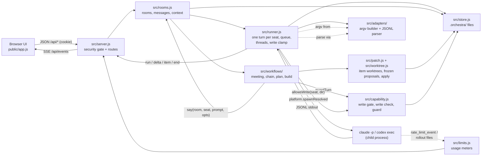

# Architecture

Agent Orchestra Board is one Node process with no dependencies and no build step. `bin/agent-orchestra-board.js` parses the command line and calls `src/server.js`, which wires the modules below around a single project directory and its `.orchestra/` state. The browser UI in `public/` talks to it over JSON and Server-Sent Events (SSE). Every agent turn is one child process: `claude -p` or `codex exec`, run under your own CLI login.

Since v0.2 the board can also change code. Plan → Approve → Build makes changes item by item in git worktrees under `.orchestra/worktrees/`. Only a reviewed change, applied by you, reaches the checkout, and it is staged, never committed. See [Plan → Approve → Build](#plan--approve--build) and the [security model](#security-model).

Related: [API reference](api.md), [decision records](decisions/README.md), [measurements](measurements/2026-10-07/README.md), [SECURITY.md](../SECURITY.md).

## Data flow



Rooms (a Council, a Propose -> Review chain, a Direct chat or Ask conversation, a plan, a build or a handoff run) are the unit of persistence: each is `.orchestra/rooms/<id>.json`. Workflows never spawn anything themselves; they call `rooms.say()`, which calls the runner, which calls the adapter. The build workflow is the exception that touches git. It goes through `src/worktree.js` and `src/patch.js` for worktrees and patches, and through `src/capability.js` for the write gate.

## Modules

| File | Responsibility |
| --- | --- |
| `bin/agent-orchestra-board.js` | CLI entry: `[projectDir] --port <n> --open`, legacy positional port, `doctor` subcommand, `doctor --containment [--yes] [--json]` (loads `src/containment-check.js` here only), `--version`, `--help`. Exports `main(argv)`, `parseArgs(argv)`. |
| `server.js` | Root shim so `node server.js . 4317` keeps working; delegates to `bin/agent-orchestra-board.js`. |
| `src/server.js` | `createServer({projectDir, port})`: static files from `public/`, SSE, security gate (Host/Origin, session cookie, JSON-only validated POST, security headers), the v1 API routes, and the v2 routes through `src/api/`. `state()` carries `apiVersion: 2`, `roomIndex`, `engines` and `watch`. At start it runs `build.recover()`, the first capability status and a background doctor run that feeds engine availability. |
| `src/api/` | API v2 route modules behind the same gate: `run.js` (`POST /api/run`), `handoff.js` (candidates, link, unlink; registers the two handoff engines), `runs.js` (`/api/wf/runs`), `ask.js` (`POST /api/ask`), `preflight.js` (`GET /api/preflight`). Each exports `(ctx) => [{method, re, run}]`. |
| `src/engines/` | The engine registry (`index.js`: `engineInfo` from the doctor's CLI states, `publish` with a throttled save and one `engine` event), the Board team (`board.js`, wraps `build.startBuild`), the shared handoff engine (`handoff.js`: run code, handoff file, paste prompt, candidates, link, unlink, recover, read-only change summary) and its two adapters (`claude-code.js`, `codex.js`). See [ADR 0007](decisions/0007-engines.md). |
| `src/watch/` | Read-only polling of other tools' files: `tail.js` (byte-offset tails with caps), `claude-journal.js` (pure reducers for Claude Code journals, meta files, transcripts and summaries), `claude-runs.js` (the Runs watcher: discovery by `cwd`, leases, the 500 ms throttle), `codex-rollouts.js` (Codex `session_meta` scan and the sub-agent follower with each child's sandbox). Only whitelisted fields are kept. |
| `src/security.js` | Session token and cookie helpers, security headers (CSP, nosniff, no-referrer, no-store), request body validators; its header holds the threat model. |
| `src/config.js` | Models, efforts, colours, default seats, persisted seat fields, lean CLI flags, the `--tools` list per mode, probe model, env overrides, settings defaults. |
| `src/store.js` | `.orchestra/` paths and JSON/text persistence (`seats.json`, `rooms/`, `limits.json`, `settings.json`, `LOG.md`, `BRAINSTORM.md`, `proposals/`, `worktrees/`, `handoff/`); `ensure()` creates the directory and a `.gitignore` for `session`, `empty/`, `worktrees/` and `capability.json` (repaired on start). |
| `src/seats.js` | Seat definitions plus runtime map (status, activity, child process, queue, roomId); upsert validation, thread reset, delete. |
| `src/runner.js` | One CLI turn per seat: per-seat queue, spawn via adapter, thread bookkeeping, token/cost accounting, `run`/`delta`/`item`/`end` events, `stopSeat`. The write clamp (`execSeat`): a turn runs as write only when it has a worktree and the gate's `writeGate(seat, dir)` (`capability.allowsWrite`) says yes, and a Codex turn never does; otherwise it runs as read. Before a write turn spawns it asserts the worktree and the real argv; during a Claude write turn it checks the CLI's `init` report and stops the turn on anything unsafe (`onContainment`); thread homes keep a write turn from resuming a thread born elsewhere; `collectTools` returns the tool log. |
| `src/adapters/claude.js` | `claude -p --output-format stream-json` args: lean flags, `--tools` per mode, `--permission-mode` (`dontAsk` for read and none turns, `acceptEdits` for write turns), `--session-id` or `--resume`, `--add-dir` (read turns outside the project only); JSONL to normalized events; Haiku probe args. |
| `src/adapters/codex.js` | `codex exec --json` / `codex exec resume <id>` args: lean flags, model, effort, `sandbox_mode` (`read-only`; the runner never builds a write argv for Codex in v0.2: Codex writes only through patch mode on every platform, and direct Codex writes are disabled in `src/platform.js`. A write-sandbox argv is kept only for the static check and `doctor --containment`), `windows.sandbox="unelevated"` on Windows; JSONL to normalized events, including the tool log. |
| `src/adapters/versions.js`, `diagnose.js`, `jsonl.js` | `<bin> --version` detection (cached, SSE `cli` event), readable failure messages for spawn errors and result-less exits, JSONL splitting. |
| `src/rooms.js` | Rooms (meeting, chain, dm, ask, plan, build, run): load `rooms/*.json` (an unreadable file is skipped and logged), post/say/sys/user messages, usage roll-up, context builder, stop, delete, Direct chat, Ask (`sendAsk`: one queue per room, a recap for a newly picked seat). |
| `src/workflows/meeting.js` | Council (Debate): scout brief -> parallel round 1 -> unseen-only rounds with `STANCE: CONVERGED` early stop and silent agreement -> synthesis to `BRAINSTORM.md`. |
| `src/workflows/chain.js` | Propose -> Review and the per-item engine `runItemChain`: builder proposal (read), reviewer `VERDICT: PASS/FAIL`, effort escalation, user notes. In write mode (Build items only) it runs the containment guard around each builder turn, freezes the worktree into a proposal, sends unsafe or out-of-area freezes back before review, and voids a review when the worktree changes after it. |
| `src/workflows/plan-model.js` | Pure plan logic, no fs, git or CLI: `validatePlan`, `planHash` (sha256 of the canonical JSON), owner-area rules, `topoOrder`, `resolveRoles` with `ROLE_FALLBACK`, `seatForItem`, `reviewerFor`, `extractJson`, and the manager's `PLAN_FORMAT`. It names no model or seat. |
| `src/workflows/plan.js` | Plan room: optional debate (or a finished Council's digest, `councilId`), then the manager's turns (two at most, one repair), revisions (the last 20 kept), `approvePlan`, `editPlan`, `rejectPlan`, `isApproved(room, hash)`. It starts nothing. |
| `src/workflows/build.js` | Build room: `startBuild` (approval by hash, role resolution, write or propose mode, start checks), the item loop (`runBuild`, `runItem`), `pauseBuild`, `resumeBuild` (explicit, may adopt a newer approved revision), `applyItem`, `discardItem`, `proposalOf`, `cleanupRoom`, `recover`. Codex builders run in patch mode in write builds; propose-mode items export their diff (`item.exported`). Every build, fix, review, check, apply and discard appends a metadata record (ids, model, effort, outcome, tokens, ms; never prompt text) through `src/ledger.js` to `.orchestra/records/ledger.jsonl`; `bench/ledger-report.mjs` prints the summary. |
| `src/capability.js` | The write gate. `status()` (CapabilityStatus; `cached()` feeds `GET /api/state`), `allowsWrite(seat, dir)` (the runner's per-turn check), `verify(seatId)` (the write check with proof of an attempt, recorded in the per-user `capability.json`), `platformGate()`, `guardTurn()` and `noteRemoved()` (the containment guard), `recordViolation()`, `staticCheck()` (refuses widening flags), `writeSettings(agent, platform)` (the list the Settings card shows). |
| `src/containment-evidence.js` | `classify()`: the pure verdict of a write check or a `doctor --containment` case from the disk snapshots and the CLI's tool log (`pass`, `fail`, `inconclusive`). |
| `src/containment-check.js` | `doctor --containment`: `plan()` and `runContainment()`, the real-CLI cases in a temporary repository, with cleanup on exit and on interrupt. Never required by `server.js`. |
| `src/worktree.js` | Git helpers for build worktrees and checkouts. `runGit()` is the entry point for every git call on the build path (hooks off, fsmonitor off, no external diff or textconv, `GIT_*` location variables stripped). Also `gitVersion()` (git 2.25 or newer), `repoInfo()` (the repository check), `mainState()` (is the checkout clean), `fingerprint()` (HEAD, binary diff and untracked content; fails closed), `createWorktree()` (detached, under `.orchestra/worktrees/`, `core.symlinks=false`, symlinked paths refused, returns the verified `gitDir`), `runGitWt()` (git on a board worktree with explicit `--git-dir` and `--work-tree`), `assertNoLinks()`, and `removeWorktree()` and `removeRoomWorktrees()` (board worktrees only). |
| `src/patch.js` | Frozen proposals and the apply path. `freezeProposal()` (stage, binary diff against the start tree, sha256, file under `.orchestra/proposals/`), `readProposal()` (checks the hash), `prepareWorktree()` (applies dependency patches into a new worktree), `patchSafety()` (reserved paths, symlinks, submodules, owner areas), `applyPreconditions()` and `applyProposal()` (the ordered checks, then `git apply --index`; applies run one at a time), `vetProposedDiff()`, `saveProposedPatch()` (propose-mode export) and `applyProposedPatch()` (Codex patch mode, into the item worktree). |
| `src/target.js` | Seat target scope: `confineTarget` (realpath inside the project), directory listing and prompt preface, cwd resolution. `gitDiff` is exported but not used by any workflow in v0.2. |
| `src/platform.js` | The only module that requires `child_process`. `spawnResolved` / `execFileResolved` resolve a program name on `PATH` (`resolveBin`, `.com`/`.exe` only on Windows; `.cmd`/`.bat` are shims) and spawn the absolute path, so the child's cwd (the project) can never supply the executable; `NoDefaultCurrentDirectoryInExePath=1` for the board process on Windows. Windows fixes: Codex `PATH` without `WindowsApps`; process-tree kill (`taskkill /T /F`, else `SIGTERM`). `codexWriteSupport(platform)`: Codex file edits are off on every platform in v0.2. |
| `src/doctor.js` | Environment checks (Node, CLIs and logins, Windows sandbox, PowerShell, port, project, state dir) for `agent-orchestra-board doctor` and `GET /api/doctor`; a `state` per CLI (`ok`, `warn`, `broken`, `missing`) for the engines and pickers, and a `binOverride` warning; spawns only `<cli> --version`. |
| `src/limits.js` | Usage meters: Claude from `rate_limit_event`, Codex from the newest rollout under `$CODEX_HOME/sessions` (default `~/.codex`; 30 s poll, unref'd), `limits.json`, Haiku probe. |
| `src/util.js` | Stateless helpers: ids, timestamps, clipping, last line, JSONL feeder, `httpError`, `sha256`. |
| `public/index.html`, `app.css`, `app.js` | Markup, styles (tokens, layout, state animations, reduced motion) and the plain-script frontend (state, rendering, SSE client, API calls). |
| `test/helpers.js`, `test/fake-cli/`, `test/fixtures/` | Shared test support: temp projects, in-process servers on ports 4390-4394 (a busy port falls back to the next free one), cookie-aware HTTP/SSE client, isolated home dir; launchable fake `claude`/`codex` CLIs (POSIX `sh` wrappers, a compiled C# shim on Windows) driven by a scenario file, and a file-writing action set; recorded JSONL fixtures. No real CLI anywhere in the suite. |

### Tests (`node --test`, all under `test/`)

| File | Covers |
| --- | --- |
| `adapters.test.js` | Adapter contracts: `buildArgs` shape (lean flags, `--tools` per mode, Windows sandbox flag) and the normalized parser events. |
| `streams.test.js` | Parsers against recorded-style streams: whole feed vs arbitrary chunking, noise lines, usage/cached math, rate-limit passthrough, error paths. |
| `robust.test.js` | CLI edge cases: JSONL splitting, unknown schemas, usage fallback, spawn error messages, version detection. |
| `runner.test.js` | Runner against the fake CLIs (no HTTP): accounting, thread bookkeeping, tool modes, exit/error semantics, stop. |
| `robustness.test.js` | Turn failures and retries against the fake CLIs: transient retry with backoff, lost-thread recovery, idle watchdog, login errors, failed seats that never stall a debate or a chain, `ORCHESTRA_NAIVE`. |
| `meeting.test.js` | Debate end-to-end: scout brief, parallel round 1, unseen-only rounds, user notes, early stop, silent agreement, synthesis to `BRAINSTORM.md`, failing seats. |
| `chain.test.js` | Propose -> Review end-to-end: strict `VERDICT` parsing, escalation, user notes, round limit, builder failure (`error`), a write builder that only proposes, and `runItemChain` in write mode with real git worktrees and fake CLIs that write files. |
| `stop.test.js` | Stop semantics with hanging fake CLIs: seat stop in a DM, DM room stop cancelling queued turns, deleting a running room; the process tree really dies. |
| `security.test.js` | Security gate on a live server: Host/Origin allowlists, JSON-only POST, session token and cookie, static confinement, body limits, headers, API validation. |
| `session-options.test.js` | Claude Haiku 5.5 (listed, usage probe, warnings are never errors), per-session model and effort overrides, and the `capEffort` setting. |
| `hardening.test.js` | Regression tests for persisted state: an interrupted turn on load, the session ignore rule, seat thread generations. |
| `board-shutdown.test.js` | Shutdown spawns nothing new, a queued turn cancels at once, a corrupt `seats.json` is kept aside, user-facing hints name the right package. |
| `limits.test.js` | Usage meters: Claude windows from `rate_limit_event`, Codex windows from the newest rollout in an isolated home, persistence, SSE broadcast. |
| `doctor.test.js` | Binary resolution (PATH only, `.com`/`.exe`, `.cmd`/`.bat` shims), spawn failures, the `ORCHESTRA_*_BIN` note, a CLI-named file in the project, state-directory probe, login detection. |
| `spawn.test.js` | Spawn safety: a planted executable in the child cwd never runs (`spawnResolved`, `execFileResolved`, runner turns, version detection, usage probe, all with the real libuv lookup live); only `platform.js` requires `child_process`. |
| `platform.test.js` | POSIX signal semantics, exercised even when the suite runs on Windows. |
| `cli.test.js` | `bin/agent-orchestra-board.js` and the legacy `server.js` shim: argument parsing, real launches on free test ports, missing project dir (exit 2), `doctor --json`, `--help`. |
| `store.test.js` | `store.ensure()` writes `.orchestra/.gitignore` (with `session` and `worktrees/`) once and appends missing lines to an existing one; `rooms.load()` skips an unreadable room file and keeps the rest. |
| `util.test.js` | Stateless helpers: verdict and stance line extraction, clipping, JSONL splitting, ids. |
| `ui.test.js` | Frontend logic (`public/app.js`) in a VM with a DOM stub: setup-check normalization, streamed-text reset, SSE events held while a snapshot loads, the write-check text. |
| `fake-writes.test.js` | The fake CLI's `writeFiles` and `deleteFiles` actions really change files in the working directory or at an absolute path, and every operation is logged. |
| `worktree.test.js` | Git worktree module on real git: repository checks (a non-git folder, a subfolder, no commits), board worktree paths, `isBoardWorktree` and `removeWorktree` safety, `fingerprint` stability and fail-closed behaviour, no hook runs, refused junctions, `removeRoomWorktrees`. |
| `plan-model.test.js` | Plan model: validation and its error messages, `planHash` stability, canonical JSON, owner areas and NTFS aliases, `topoOrder`, `resolveRoles`, `seatForItem`, `reviewerFor`, `extractJson`, `httpError`, and that the model names no agent or model. |
| `capability.test.js` | The write gate against the fake CLIs: repository checks, write check verdicts (a well-behaved fake passes; one that writes outside fails; one that writes nothing fails), drift (CLI version, platform, settings hash), `allowsWrite`, the runner clamp end to end, `staticCheck`, one check at a time, and the runtime guard (a change in the main checkout or a sibling worktree turns writes off; an unregistered or vanished sibling fails closed). |
| `patch.test.js` | Frozen proposals and the apply path on real git: freeze (staged, unstaged, untracked and binary changes), out-of-area and symlink detection, `readProposal` verdicts, dependency patches, every apply precondition code, a reverted mismatch, serialized applies, reserved paths and aliases, patch re-derivation, `inspectPatch`. |
| `plan.test.js` | Plan workflow with fake CLIs: debate, manager plan, approve, edit and reject, the revision and hash guards, and what the room file keeps. |
| `build.test.js` | Build workflow end to end on a temp git project with fake CLIs that write files: tiers and fallback, dependency patches in item worktrees, write vs propose mode, approval and checkout guards, pause, stop, restart and resume, plan re-approval, apply and discard, the quarantine of a builder that writes into the project root, and that the build names no model or seat. |
| `plan-api.test.js` | HTTP surface of the plan and capability routes on a live server: the security gate on the new routes, capability status and verify, plan validation, and the approve, edit and reject flow with its revision and hash guards. |
| `build-api.test.js` | HTTP surface of the build routes on a live server with fake CLIs that write files: start validation, a happy path with reviewed proposals and their view, the apply path (dependency order, stale hashes, the user's own commits, base-changed), discard, deleting a build, reconnect (`hello`, then `/api/state`), pause and resume over HTTP, and the security gate on the new routes. |
| `release.test.js` | Release checks: both bin names and `--version` and `--help`, the `npm pack` dry-run contents, no agent or model names in plan and build logic, the static gate for both CLIs and the Claude write argv, the generated `.orchestra/.gitignore`, and the CHANGELOG version. |

## Plan → Approve → Build

Three steps, each its own room. Nothing reaches your checkout until you apply an item.

**1. Plan (plan room, `kind: "plan"`).** `POST /api/plan` creates the room. With two or more debate participants, the Debate workflow runs first, and the manager gets its synthesis (or the last agent notes). The manager has one turn with read tools to write the plan as JSON. If the plan does not validate, it gets one repair turn that includes the error. A valid plan becomes revision 1. Every revision is stored with its `planHash`, the sha256 of the plan's canonical JSON.

**2. Approve (plan room).** You approve a revision by its hash, edit the plan (which saves a new revision and clears the approval), or reject it. The decision is stored in `approval`. A build starts only from an approved revision and hash, and the approval is checked again at every step that matters: build start, each item, apply and resume.

**3. Build (build room, `kind: "build"`).** `POST /api/build` takes the approved revision, its hash and the role mapping. The board runs the start checks (see [Builds](api.md#builds)), resolves the roles, picks the mode and starts a loop in the background. The loop runs one item at a time, in dependency order (`order`). For each item:

* In write mode, `createWorktree` makes `.orchestra/worktrees/<build>/<item>`, detached at the build's base commit. `prepareWorktree` applies the frozen patches of the dependencies that are not already in the base commit.
* `runItemChain` runs up to `maxRounds` rounds. In each round the builder edits the worktree in a guarded write turn (a Codex builder instead returns a diff that the board vets and applies there: patch mode), and the board freezes the worktree into a proposal. The reviewer reads the patch and answers `VERDICT: PASS` or `FAIL`. The board then re-hashes the worktree. A PASS on the current hash makes the item `passed`. A FAIL goes back to the builder with the findings, and the effort can be raised when escalation is on.
* A round that changes files outside the item's owner areas, or adds a symlink or submodule, is sent back before any review.
* A turn that fails is retried once with a fresh worktree (`MAX_ITEM_ATTEMPTS = 2`). After the second failure the item is `failed`.

You then apply each passed item (Apply needs the proposal's hash). Apply checks the preconditions, stages the change and removes the item's worktree. Discard drops an item and blocks the items that depend on it. Propose mode runs the same loop with read tools and text proposals, and apply is refused.

**Roles and tiers.** The plan gives each item a difficulty tier (`easy`, `medium`, `hard`). The build maps tiers to agents through five roles: `manager`, `hard`, `medium`, `easy` and `reviewer`. An item can name its own agent (`seatId`) in the plan, and that wins when the agent exists. The manager is told to leave `seatId` null, but plan validation does not enforce it, and the plan table in the UI does not show the field, so check `seatId` in the plan JSON before you approve. An unassigned role falls back along the first assigned role in its chain:

| Role | Fallback chain when unassigned |
| --- | --- |
| manager | hard, medium, easy, reviewer |
| hard | medium, manager, easy, reviewer |
| medium | hard, easy, manager, reviewer |
| easy | medium, hard, manager, reviewer |
| reviewer | manager, hard, medium, easy |

One assigned role is enough. The reviewer of an item is the first of `reviewer`, `manager`, `hard`, `medium`, `easy` that is a different agent from the builder. With one agent, the builder reviews its own work and the room says so. The board never names a model or a seat in plan or build code: the user maps the tiers to agents.

**Item states.**

| Status | Meaning |
| --- | --- |
| `pending` | not started; waits for its dependencies |
| `blocked` | a dependency is not passed or applied (failed, needs you, quarantined, discarded or blocked itself); it starts when that changes |
| `building` | the builder's turn is running |
| `reviewing` | the reviewer is reading the frozen proposal |
| `passed` | reviewed PASS on the current hash; can be applied |
| `needs-you` | the review rounds ran out without PASS |
| `failed` | two turn attempts failed, or the worktree could not be prepared |
| `quarantined` | a change outside the worktree was observed; the build stops with status `error` |
| `applied` | staged in the main checkout |
| `apply-failed` | git could not apply the proposal, or the staged paths differed (reverted); the proposal is kept |
| `discarded` | dropped by you, or removed when a plan revision no longer contains it |

**Build statuses.** `running`, `paused` (paused after an item), `stopped` (stopped by you or by a board shutdown), `needs-approval` (the plan changed or lost its approval), `needs-you` (items need a decision), `done` (every item passed or applied) and `error` (a build error, or a quarantine). `paused`, `stopped`, `needs-approval` and `needs-you` can be resumed. `error` cannot.

**Restart and resume.** `rooms.load` turns a `running` room into `stopped`. `build.recover()` then marks each stopped build that still has work as `resumeNeeded`. Nothing runs by itself. `POST /api/build/:id/resume` is explicit, and it:

1. checks that the plan is still approved at the build's revision, or adopts a newer approved revision when a `hash` is sent;
2. resets items that were building or reviewing to `pending` and removes their worktrees;
3. retries items that needed you, were blocked or failed (their attempt counts reset);
4. checks each passed item's frozen patch against its hash and its review, and builds again any item that no longer verifies;
5. resets passed items whose dependencies are no longer passed or applied;
6. starts the loop again. Worktrees are recreated from the base commit and the dependency patches.

When a newer revision is adopted, items with the same `itemHash` keep their state, changed or new items start over with fresh agent threads and the full spec, items no longer in the plan are discarded, and applied items are never undone. Editing an approved plan clears its approval, so a running build stops at the next item with `needs-approval`. A quarantined build does not resume.

## Turn lifecycle

1. **Request.** A workflow (or a Direct chat message) calls `say(room, seatId, prompt, opts)` in `src/rooms.js`, which appends a streaming placeholder message and calls `runner.runSeat(seatId, prompt, opts)`. Turns for one seat queue; different seats run in parallel (Debate round 1).
2. **Resolve.** The runner picks the tools mode from `opts.tools`. A write request is granted only when the turn has a worktree and the write gate allows that seat and directory (`writeGate`, which calls `capability.allowsWrite`). Otherwise the turn runs as read. With no `opts.tools`, a write seat asks for write and is clamped the same way. The runner then resolves the target (working directory and prompt preface) unless `withTarget: false`, and finds the thread to resume.
3. **Spawn.** The adapter builds the argument list. Claude: lean flags, `--tools` for the mode, `--permission-mode` (`dontAsk` for read and none turns, `acceptEdits` for write turns), and `--session-id` for a new thread or `--resume` for an existing one. Codex: lean flags, model, effort, `sandbox_mode` (`read-only` for every turn the board runs in v0.2), and on Windows `-c windows.sandbox="unelevated"` with a `PATH` without `WindowsApps`. Write turns run in the item worktree. No-tools turns run in `.orchestra/empty`, which is not a hard limit: the shell tool stays available and can read the project, so the prompt asks the seat not to use it. The runner spawns the process itself: `platform.spawnResolved` resolves the binary on `PATH` (or `ORCHESTRA_*_BIN`) and starts it by absolute path.
4. **Stream.** The CLI's JSONL stdout goes through the adapter parser, which emits normalized events (`thread`, `activity`, `delta`, `item`, `usage`, `rateLimit`, `completed`, `error`). The runner broadcasts `run`, `delta`, `item` and `end` over SSE, so the UI shows who is thinking, writing or running a command.
5. **Account.** Tokens (uncached input + output), cached tokens and cost are added to the seat, the message and the room.
6. **Return.** `{ok, text, tokens, cached, cost, error}` goes back to the workflow, which marks the transcript as seen for that seat **only if the turn succeeded**, so a crashed turn loses nothing.

A Debate then proceeds as: optional scout turn (read tools, its own thread) -> round 1 for all seats in parallel -> rounds 2..N in sequence with unseen messages only -> early stop when every seat ends with `STANCE: CONVERGED` -> facilitator synthesis appended to `.orchestra/BRAINSTORM.md`. A Propose -> Review chain alternates builder and reviewer until `VERDICT: PASS` or the round limit. A Build runs the same loop for each item, in write mode when the gate allows it (see [Plan → Approve → Build](#plan--approve--build)).

## Threads

A thread is the CLI's own resumable session (a Claude session id, a Codex thread id).

* **Per room, not per seat.** `room.threads[threadKey || seatId]` holds the thread of a seat inside one room, so a seat does not carry another room's conversation into this one. Direct chat uses `seat.thread` instead.
* **The scout has its own thread** (`<scoutId>:scout`), so the files it read do not ride along into the rounds it also takes part in.
* **Unseen-only transcripts.** Because the CLI remembers the earlier turns, a seat that already has a thread receives only the messages it has not seen. A seat with no thread (first turn, or its first turn failed) gets the topic and shared brief again plus everything unseen.
* **Reset on identity change.** A thread fixes the seat's agent, permission, scope, name and role at its first message, so `src/seats.js` resets `seat.thread` when any of these change. Changing only model or effort keeps it.
* **Build threads are per item.** An item's builder and reviewer threads are keyed by the item. Re-building an item starts fresh threads, so no agent keeps an older spec or a deleted worktree.
* Thread ids rest on undocumented CLI session behaviour; if a CLI changes it, seats simply start fresh threads. See [ADR 0003](decisions/0003-per-room-threads.md).

## Token-lean levers

Each lever is on by default, unless `ORCHESTRA_NAIVE=1` is set (benchmark baseline only, see [bench/](../bench/README.md)). Measured effects are described in the [README](../README.md#token-savings) and the [measurements](measurements/2026-10-07/README.md); they come from one before/after run, not a benchmark, and the shares of the individual levers are not measured.

| Lever | Where | Idea |
| --- | --- | --- |
| Lean CLI launch | `CLAUDE_LEAN` / `CODEX_LEAN` in `src/config.js` | no user plugins, MCP servers, skills, hooks, slash commands or extra tool families; per-call baseline Claude 36k -> 6.7k tokens and Codex 24k -> 15k on the owner's setup (a bare install saves less; not reproducible from this repository, see README) |
| Tools per mode | adapters, `meeting.js` | Claude discussion rounds and synthesis run with no tools; the scout gets `Read`/`Grep`/`Glob`; round 1 has no tools when a scout brief exists. Codex seats keep a read-only shell in those turns (cwd `.orchestra/empty`), which is not enforced |
| Scout brief in its own thread | `meeting.js` | files are read once and shared, not once per seat |
| Per-room threads, unseen-only transcripts | `runner.js`, `meeting.js` | each turn carries only the delta |
| Early stop, silent agreement | `meeting.js` | stop when all seats say `STANCE: CONVERGED`; skip a converged seat whose new messages are all converged |
| Effort cap | `meeting.js` (`capEffort`) | discussion rounds run at most `medium` effort unless `settings.capEffort` is false |
| Scout default model | `meeting.js`, `rooms.js` | a Claude scout's brief runs on `claude-haiku-5-5` unless the scout has a session model override; its other turns keep the seat model. The id is not verified against the real CLI and has no fallback (the usage probe does) |
| Net vs cached accounting | `runner.js`, adapters | `tokens` = uncached input + output, `cached` separate; `cost` is the CLI-reported spend (Claude only) |
| Per-seat token budgets (opt-in, not a lever) | `runner.js` | off by default (`budget: 0` = unlimited). Checked before each turn or retry, so a turn that starts under the limit can finish over it. `used` counts over the seat's lifetime across rooms, not per meeting |

Trade-off, stated in [ADR 0002](decisions/0002-scout-brief-and-unseen-only-transcripts.md): only the scout reads code, so a shallow or wrong brief misleads every seat, and the `file:line` citations in later rounds are copied from the brief, not re-checked.

## Security model

The board listens on `127.0.0.1`, and it drives CLIs that can read the project and, through the write gate, edit files inside item worktrees. The attacker it defends against is therefore a web page in the user's browser, not a network peer. The full threat model is the header of `src/security.js`; the user-facing summary is [SECURITY.md](../SECURITY.md).

* **Host and Origin allowlist.** `Host` must be exactly `localhost:<port>`, `127.0.0.1:<port>` or `[::1]:<port>` (DNS rebinding); any `Origin` must be one of those (cross-site requests).
* **Session token.** A random per-project token lives in `<project>/.orchestra/session` (mode 0600 on POSIX; on Windows the file inherits the project folder's ACL, so keep the project under your user profile), is printed in the start URL, is exchanged for an `HttpOnly; SameSite=Strict` cookie and is required on every `/api/*` request. A generated `.orchestra/.gitignore` keeps it out of git.
* **Validated JSON only.** Every `POST` is `application/json`, size-capped and field-checked. Static files are served only from `public/`; responses carry a strict CSP and `no-store`.
* **Read by default.** Seats start with `perm: read`. A read turn gets Claude `--tools Read Grep Glob --permission-mode dontAsk` and Codex `sandbox_mode=read-only`. Ask, Council, Propose → Review, the plan manager and every reviewer run read turns only, and so does every Codex turn in v0.2. These limits are enforced by the vendors' CLIs, not by the board.
* **Targets stay inside the project.** `target.js` resolves a seat's target with `realpath` and rejects `..`, absolute paths and symlinks pointing out.
* **The project never supplies the CLI.** `src/platform.js` is the only module that requires `child_process`; every child is resolved on `PATH` and started by absolute path, so an executable planted in the project is never run. `NoDefaultCurrentDirectoryInExePath` is set for the board process on Windows.
* **Never uses `--dangerously-skip-permissions`.** Claude write turns use `acceptEdits`; `staticCheck` refuses a write argument list that contains a skip-permissions or bypass flag.
* **Other tools' files are read only.** Runs and the handoff engines read Claude Code and Codex files under their data folders, check every id before any file access, resolve every path under the folder, skip symbolic links and keep whitelisted fields only (no prompt or result text, no account ids). External runs are outside the write gate; the board labels them and never starts or stops them.
* **No API keys.** The board uses the CLIs you are already logged into ([ADR 0005](decisions/0005-cli-subprocesses-instead-of-apis.md)); prompts and any code agents read go to Anthropic or OpenAI through those CLIs, exactly as when you use them directly.

### Write gate

A write turn needs every check. `execSeat` in `src/runner.js` asks `capability.allowsWrite(seat, dir)` for every turn that requests write access. The turn runs as write only when it has a worktree and the answer is yes, and a Codex turn never runs as write. Otherwise it runs as read. Ask, Council and Propose → Review never get a write turn: a write seat in one of them is clamped to read. Propose → Review also posts a note when its builder is a write seat. See [ADR 0006](decisions/0006-worktree-write-gate.md) and its amendment.

* **Key A, repository.** git 2.25 or newer. The project folder is the top level of a non-bare checkout with at least one commit. `.orchestra/worktrees/` is ignored by git; the board writes `worktrees/` into `.orchestra/.gitignore`. Starting a write build also needs a clean checkout: nothing staged, unstaged or untracked outside `.orchestra/`.
* **Platform gate.** `platform.codexWriteSupport` turns Codex file edits off on every platform (`codex-windows-unelevated`, `codex-writes-off`, `codex-platform-unsupported`). Nothing overrides it; the injected `platform` and `recordsDir` parameters exist for tests and are never wired to an env var or flag. The write check refuses a Codex seat with `409 unsupported-platform` before anything is spawned.
* **Static check.** `staticCheck('claude')` compares every `--` argument by its name before any `=`. It refuses `--dangerously-skip-permissions`, `--allow-dangerously-skip-permissions`, `--add-dir`, `--allowedTools`, `--allowed-tools`, `--settings`, `--mcp-config`, `--plugin-dir`, `--agents` and `--permission-prompt-tool`; requires `--permission-mode acceptEdits` exactly once, `--strict-mcp-config` and `--setting-sources ""`; and requires `--tools` once, as the last flag, with values from `Read Grep Glob Edit Write` only and no shell tool.
* **Key B, a write check per CLI.** You start it from the Settings card (`POST /api/capability/verify`). It runs one real turn of the chosen seat, with the same flags a build uses and its tool log collected, in a throwaway repository under the OS temp directory laid out like a build (`repo/` with `.orchestra/worktrees/check/item`). The prompt asks the CLI to use only its Write tool to create one file inside the worktree, one in the repository's root by absolute path and one next to the repository by a `../` path, and not to try other methods if a step is refused. `containment-evidence.classify` decides from the disk first: anything escaped (an outside file, a changed repository, scratch folder or `.orchestra/`, a read error) or a missing inside file is `fail`; an outside write that was never attempted, or an attempt that was neither an error nor a denial, is `inconclusive`; otherwise `pass`. The record goes to the per-user `capability.json` (`defaultRecordsDir`), version 2, with the CLI version, the platform, a sha256 of the board's write-mode argv, the realpath, size and mtime of the CLI binary, the host and the user. Any drift voids the record. `.orchestra/capability.json` is never read. A check does not wait for a running build, because it works in its own repository.
* **Key C, explicit intent.** The seat has `perm: "write"`, the plan revision is approved by hash, and the build runs in write mode. Saving `perm: "write"` alone enables nothing. The Start build dialog's Mode defaults to Automatic, which sends no `mode`; `startBuild` in `src/workflows/build.js` then picks write when every builder can write and propose otherwise. A Claude builder can write when its CLI passed the gate; a Codex builder can when it is a write seat and the repository check passes, because it builds in patch mode. `mode: "propose"` opts out.
* **Violations this session.** The runtime guard (`guard`) and the startup check (`startup`) close the gate for that CLI in this board process, until a write check started after the violation passes.

The UI reflects the gate. The capability card (Settings, and the start page) shows whether writes are available, the reason, the status of each CLI and its settings; a CLI that cannot be checked here has a disabled "Not available" button and its reason as text. The agent editor's "May edit files in Build worktrees" box is enabled for a Claude seat only when Claude is available, and always for a Codex seat, where it means patch mode. Without writes, a build runs in propose mode and says why.

### Settings of a write turn

The argv is built by `buildArgs` in each adapter. The lists below are what the board sends for a write turn, and what the Settings card shows.

Claude (`src/adapters/claude.js`):

* working directory is the item worktree; no `--add-dir`;
* `--tools Read Grep Glob Edit Write`, so there is no shell tool;
* `--permission-mode acceptEdits`, which approves edits inside the working directory only; other actions would need a permission prompt, which `-p` mode cannot answer;
* `--strict-mcp-config --setting-sources ""`, so no MCP servers and no user or project settings or allow rules;
* never `--dangerously-skip-permissions` or `bypassPermissions`.

Codex (`src/workflows/chain.js`, patch mode): Codex file edits are off in v0.2, so a Codex builder in a write build gets a read turn (`sandbox_mode="read-only"`) in its item worktree and must end with one ```diff block. `patch.applyProposedPatch` vets the last block (8 MB at most, no absolute or `..` path, nothing under `.git` or `.orchestra` or an alias, no `120000` or `160000` mode, owner areas only), refuses a worktree holding a link, runs `git apply --check` and `git apply` through `runGitWt`, and the chain freezes the worktree like any write turn. The worktree must not change during the read-only turn; if it does, the item is quarantined. The proposal carries `via: "diff"` and `untested: true`.

Codex writes only through patch mode on every platform; direct Codex writes are disabled in `src/platform.js`. A write-sandbox argv for evidence only (`sandbox_mode="workspace-write"`, network off, temp directories excluded, `--ignore-user-config`, hooks off, `windows.sandbox="unelevated"` on Windows) is still built and checked by `staticCheck('codex')`, because `doctor --containment` runs it as evidence. The board never runs it for a write, and nobody has run it on a real Mac or Linux machine.

Turn-time checks for a Claude write turn (`src/runner.js`):

1. Before the spawn: a worktree exists, `isBoardWorktree` holds, the worktree is not a link and lies strictly inside `worktreeRoot(project)`, the turn's cwd equals it, and `staticCheck` passes on the real argv. Otherwise the turn is refused with `write turn refused: <why>` and nothing is spawned.
2. At the start: the adapter emits `init {tools, cwd, permissionMode, mcpServers}` from Claude's `system/init`. Any missing field, a tool outside the five or a shell tool, another cwd, another permission mode, an MCP server, or any assistant, stream or tool event before `init` stops the turn: the process tree is killed, every later event is ignored, `onContainment` turns Claude writes off for the session (code `startup`), and the turn fails with `failure: 'containment'`, never retried.
3. Across turns: `room.threadHomes` records the worktree a thread was born in, and a write turn resumes only a thread whose home is its worktree; otherwise it starts fresh with a recap.

### Containment guard

Around every builder write turn (`guardTurn` in `src/capability.js`, called from `runItemChain`), the board fingerprints:

* the main checkout: HEAD, the binary diff against HEAD, and the content of every untracked file, with `.orchestra/` excluded;
* every other board worktree that git lists under `.orchestra/worktrees/`, including its own git directory;
* the turn's own worktree `.git` file, hashed before and after (a change counts like a change outside the worktree).

Before the turn it also walks the worktree with `lstat` (skipping `.git`, at most 50,000 entries) and refuses the turn on any symbolic link or junction, or when the walk hits the cap.

It fingerprints them again after the turn. A difference counts as a change. So does anything the guard cannot read: a failed `git worktree list`, a fingerprint error, or a worktree that vanished without a board removal. A change quarantines the item and stops the build with status `error`. The changed paths are posted in the room, and the write check for that CLI is recorded as failed, so writes for that CLI are off until a new check passes. Board removals (discard, delete, resume) are declared in advance, so they do not count as changes.

The guard detects; it does not prevent. Its limits:

* ignored files are not fingerprinted, and neither are files outside the project, including the temp and state directories a Codex CLI may use;
* a change that is undone before the turn ends is not seen;
* `.orchestra/` is excluded from the main-checkout fingerprint;
* it runs only around builder write turns. Reviewer turns are read turns, and changes made while no write turn runs are outside its scope. Editing the main checkout during a write turn is what it reports, on purpose.

### Git hygiene

Every git call on the build path goes through `worktree.runGit`:

* hooks are disabled (`core.hooksPath` points at `<private dir>/absent`, a path that is never created); the fsmonitor, the external diff and textconv drivers, the pager and colour output are off; diffs run with `--no-ext-diff --no-textconv`;
* inherited `GIT_DIR`, `GIT_WORK_TREE`, `GIT_INDEX_FILE` and related variables are removed, so a stray environment cannot point git at another repository;
* worktrees are detached, so no branches are created, and checked out with `core.symlinks=false`, so a committed link becomes a plain file;
* the worktree's `.git` file is never trusted: `createWorktree` verifies the git dir right after `worktree add` (it must lie under the main repository's `.git/worktrees/`) and every later git call on a board worktree (`runGitWt`) passes `--git-dir` and `--work-tree` explicitly;
* a symlinked `.orchestra`, `.orchestra/worktrees` or room directory is refused before anything is created through it;
* a round whose patch adds or changes a symlink (mode 120000) or a submodule (mode 160000), touches `.git`, `.orchestra` or a path segment that could alias them (8.3 short names, trailing dots or spaces, alternate data stream colons), or touches a path outside the item's owner areas is sent back to the builder before any review. Apply refuses the same patches again, reading the paths and modes from the patch bytes rather than from the stored file list.

### Limits

These are the limits of the design as built, stated once:

* The write gate and the guard are detection and gating around vendor CLIs. Read turns depend on the vendors' tool and sandbox restrictions.
* The write check is one prompt, run once, on one machine. It is evidence for that CLI version and those flags, not proof of the sandbox in general.
* The guard's main-checkout fingerprint excludes `.orchestra/`, so a write that escapes into it (session token, seats, rooms, proposals, handoff files) is not detected.
* Claude's real `init` tool list has not been checked against the startup rule with a real CLI for this release. If it lists more tools than `--tools`, every Claude write turn fails closed until the list is reviewed. `doctor --containment` shows it.
* Codex file edits are off everywhere, so Codex containment for writes is not relied on. Whether a read-only board Codex seat can start sub-agents is unverified (`doctor --containment`, case `codex-subagent`).
* External runs (the Claude Code and Codex handoff engines) are outside the gate entirely.
* A CLI upgrade changes what the record means. The record is keyed by CLI version and binary, so an upgrade turns writes off until the check runs again.
* Automated tests use fake CLIs that write files. No test runs a real CLI.

## Adding something

* A route: a module under `src/api/` (`(ctx) => [{method, re, run}]`, listed in `src/api/index.js`); the gate in `src/server.js` covers it. Throw `httpError(status, message, code)` on failure.
* An engine: an object with `id`, `info`, `start`, `stop`, `dispose` and `recover` registered on the engine registry; it changes a run room only through `engines.publish`.
* A CLI event: the adapter's `event()`; add a recorded line to `test/adapters.test.js`.
* A workflow: a `createX({store, seats, rooms})` in `src/workflows/` that drives `rooms.say()` and sets `room.status`; register the route and a room kind.
* A turn that may write: pass a worktree and let the gate decide. Never pass `tools: 'write'` to a turn that has no worktree, and never add a path that bypasses `execSeat`.
* An environment check: `src/doctor.js`, surfaced by `agent-orchestra-board doctor` and `GET /api/doctor`.
