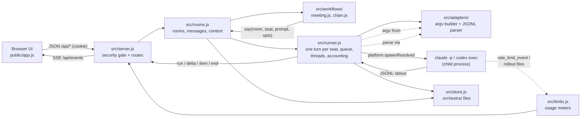

# Architecture

Agent Orchestra Board is one Node process with no dependencies and no build step. `bin/agent-orchestra-board.js` parses the command line and calls `src/server.js`, which wires the modules below around a single project directory and its `.orchestra/` state. The browser UI in `public/` talks to it over JSON and Server-Sent Events (SSE). Every agent turn is one child process: `claude -p` or `codex exec`, run under your own CLI login.

Related: [API reference](api.md), [decision records](decisions/README.md), [measurements](measurements/2026-10-07/README.md), [SECURITY.md](../SECURITY.md).

## Data flow

Rooms (a Debate, a Propose -> Review chain or a Direct chat) are the unit of persistence: each is `.orchestra/rooms/<id>.json`. Workflows never spawn anything themselves; they call `rooms.say()`, which calls the runner, which calls the adapter.

## Modules

| File | Responsibility |
| --- | --- |
| `bin/agent-orchestra-board.js` | CLI entry: `[projectDir] --port <n> --open`, legacy positional port, `doctor` subcommand. Exports `main(argv)`, `parseArgs(argv)`. |
| `server.js` | Root shim so `node server.js . 4317` keeps working; delegates to `bin/agent-orchestra-board.js`. |
| `src/server.js` | `createServer({projectDir, port})`: static files from `public/`, SSE, security gate (Host/Origin, session cookie, JSON-only validated POST, security headers), every API route. |
| `src/security.js` | Session token and cookie helpers, security headers (CSP, nosniff, no-referrer, no-store), request body validators; its header holds the threat model. |
| `src/config.js` | Models, efforts, colours, default seats, persisted seat fields, lean CLI flags, probe model, env overrides, settings defaults. |
| `src/store.js` | `.orchestra/` paths and JSON/text persistence (`seats.json`, `rooms/`, `limits.json`, `settings.json`, `LOG.md`, `BRAINSTORM.md`); `ensure()` creates the directory and a `.gitignore` for `session`. |
| `src/seats.js` | Seat definitions plus runtime map (status, activity, child process, queue, roomId); upsert validation, thread reset, delete. |
| `src/runner.js` | One CLI turn per seat: per-seat queue, spawn via adapter, thread bookkeeping, token/cost accounting, `run`/`delta`/`item`/`end` events, `stopSeat`. |
| `src/adapters/claude.js` | `claude -p --output-format stream-json` args (lean flags, `--tools` per mode, `--permission-mode` (`dontAsk` for read/none turns, `acceptEdits` for write), `--session-id`/`--resume`, `--add-dir`) and JSONL -> normalized events; Haiku probe args. |
| `src/adapters/codex.js` | `codex exec --json` / `codex exec resume <id>` args (lean flags, model, effort, `sandbox_mode`, `windows.sandbox=unelevated`) and JSONL -> normalized events. |
| `src/adapters/versions.js`, `diagnose.js`, `jsonl.js` | `<bin> --version` detection (cached, SSE `cli` event), readable failure messages for spawn errors and result-less exits, JSONL splitting. |
| `src/rooms.js` | Rooms (meeting, chain, dm): load `rooms/*.json` (an unreadable file is skipped and logged), post/say/sys/user messages, usage roll-up, context builder, stop, delete, Direct chat. |
| `src/workflows/meeting.js` | Debate: scout brief -> parallel round 1 -> unseen-only rounds with `STANCE: CONVERGED` early stop and silent agreement -> synthesis to `BRAINSTORM.md`. |
| `src/workflows/chain.js` | Propose -> Review: builder proposal or edits, `git diff` for write seats, `VERDICT: PASS/FAIL` loop, effort escalation, user notes. |
| `src/limits.js` | Usage meters: Claude from `rate_limit_event`, Codex from the newest rollout under `$CODEX_HOME/sessions` (default `~/.codex`; 30 s poll, unref'd), `limits.json`, Haiku probe. |
| `src/target.js` | Seat target scope: `confineTarget` (realpath inside the project), directory listing, prompt preface, cwd resolution, `git diff` including untracked files. |
| `src/platform.js` | The only module that requires `child_process`. `spawnResolved` / `execFileResolved` resolve a program name on `PATH` (`resolveBin`, `.com`/`.exe` only on Windows; `.cmd`/`.bat` are shims) and spawn the absolute path, so the child's cwd (the project) can never supply the executable; `NoDefaultCurrentDirectoryInExePath=1` for the board process on Windows. Windows fixes: Codex `PATH` without `WindowsApps`; process-tree kill (`taskkill /T /F`, else `SIGTERM`). |
| `src/doctor.js` | Environment checks (Node, CLIs and logins, Windows sandbox, PowerShell, port, project, state dir) for `agent-orchestra-board doctor` and `GET /api/doctor`; spawns only `<cli> --version`. |
| `src/util.js` | Stateless helpers: ids, timestamps, clipping, last line, JSONL feeder. |
| `public/index.html`, `app.css`, `app.js` | Markup, styles (tokens, layout, state animations, reduced motion) and the plain-script frontend (state, rendering, SSE client, API calls). |
| `test/helpers.js`, `test/fake-cli/`, `test/fixtures/` | Shared test support: temp projects, in-process server on 4390-4394, cookie-aware HTTP/SSE client, isolated home dir; launchable fake `claude`/`codex` CLIs (POSIX `sh` wrappers, a compiled C# shim on Windows) driven by a scenario file; recorded JSONL fixtures. No real CLI anywhere in the suite. |
| `src/adapters/robust.test.js` | Adapter robustness tests kept next to the adapters; `node --test` picks it up too (so it ships in the npm package via `files: ["src"]`). |

### Tests (`node --test`, all under `test/` unless noted)

| File | Covers |
| --- | --- |
| `adapters.test.js` | Adapter contracts: `buildArgs` shape (lean flags, `--tools` per mode, Windows sandbox flag) and the normalized parser events. |
| `streams.test.js` | Parsers against recorded-style streams: whole feed vs arbitrary chunking, noise lines, usage/cached math, rate-limit passthrough, error paths. |
| `src/adapters/robust.test.js` | JSONL splitting, unknown schemas, usage fallback, spawn error messages, version detection. |
| `runner.test.js` | Runner against the fake CLIs (no HTTP): accounting, thread bookkeeping, tool modes, exit/error semantics, stop. |
| `meeting.test.js` | Debate end-to-end (port 4392): scout brief, parallel round 1, unseen-only rounds, user notes, early stop, silent agreement, synthesis to `BRAINSTORM.md`, failing seats. |
| `chain.test.js` | Propose -> Review end-to-end (port 4393): strict `VERDICT` parsing, escalation, user notes, round limit, builder failure (`error`), write-seat `git diff`. |
| `stop.test.js` | Stop semantics with hanging fake CLIs (port 4394): seat/DM/meeting stop, deleting a running room; the process tree really dies. |
| `security.test.js` | Security gate on a live server (port 4391): Host/Origin allowlists, JSON-only POST, session token and cookie, static confinement, body limits, headers, API validation. |
| `limits.test.js` | Usage meters: Claude windows from `rate_limit_event`, Codex windows from the newest rollout in an isolated home, persistence, SSE broadcast. |
| `doctor.test.js` | Binary resolution (PATH only, `.com`/`.exe`, `.cmd`/`.bat` shims), spawn failures, the `ORCHESTRA_*_BIN` note, a CLI-named file in the project, state-directory probe, login detection. |
| `spawn.test.js` | Spawn safety: a planted executable in the child cwd never runs (`spawnResolved`, `execFileResolved`, runner turns, version detection, usage probe, all with the real libuv lookup live); only `platform.js` requires `child_process`. |
| `cli.test.js` | `bin/agent-orchestra-board.js` and the legacy `server.js` shim: argument parsing, real launches on 4395-4399, missing project dir (exit 2), `doctor --json`, `--help`. |
| `store.test.js` | `store.ensure()` writes `.orchestra/.gitignore` once; `rooms.load()` skips an unreadable room file and keeps the rest. |
| `util.test.js` | Stateless helpers: verdict/stance line extraction, clipping, JSONL splitting, ids. |

## Turn lifecycle

1. **Request.** A workflow (or a Direct chat message) calls `say(room, seatId, prompt, opts)` in `src/rooms.js`, which appends a streaming placeholder message and calls `runner.runSeat(seatId, prompt, opts)`. Turns for one seat queue; different seats run in parallel (Debate round 1).
2. **Resolve.** The runner picks the tools mode: `opts.tools`, downgraded from `write` to `read` unless `seat.perm === 'write'`; with no `opts.tools` the seat's own permission applies. It resolves the target (working directory and prompt preface) unless `withTarget: false`, and finds the thread to resume.
3. **Spawn.** The adapter builds the argument list. Claude: lean flags, `--tools` for the mode, `--session-id` for a new thread or `--resume` for an existing one. Codex: lean flags, model, effort, `sandbox_mode`, and on Windows `-c windows.sandbox="unelevated"` with a `PATH` without `WindowsApps`; no-tools turns run in `.orchestra/empty` so the shell tool has nothing to read. The runner (not the adapter) spawns the process: `platform.spawnResolved` resolves the binary on `PATH` (or `ORCHESTRA_*_BIN`) and starts it by absolute path.
4. **Stream.** The CLI's JSONL stdout goes through the adapter parser, which emits normalized events (`thread`, `activity`, `delta`, `item`, `usage`, `rateLimit`, `completed`, `error`). The runner broadcasts `run`, `delta`, `item` and `end` over SSE, so the UI shows who is thinking, writing or running a command.
5. **Account.** Tokens (uncached input + output), cached tokens and cost are added to the seat, the message and the room.
6. **Return.** `{ok, text, tokens, cached, cost, error}` goes back to the workflow, which marks the transcript as seen for that seat **only if the turn succeeded**, so a crashed turn loses nothing.

A Debate then proceeds as: optional scout turn (read tools, its own thread) -> round 1 for all seats in parallel -> rounds 2..N in sequence with unseen messages only -> early stop when every seat ends with `STANCE: CONVERGED` -> facilitator synthesis appended to `.orchestra/BRAINSTORM.md`. A Propose -> Review chain alternates builder and reviewer until `VERDICT: PASS` or the round limit.

## Threads

A thread is the CLI's own resumable session (a Claude session id, a Codex thread id).

- **Per room, not per seat.** `room.threads[threadKey || seatId]` holds the thread of a seat inside one room, so a seat does not carry another room's conversation into this one. Direct chat uses `seat.thread` instead.
- **The scout has its own thread** (`<scoutId>:scout`), so the files it read do not ride along into the rounds it also takes part in.
- **Unseen-only transcripts.** Because the CLI remembers the earlier turns, a seat that already has a thread receives only the messages it has not seen. A seat with no thread (first turn, or its first turn failed) gets the topic and shared brief again plus everything unseen.
- **Reset on identity change.** A thread fixes the seat's agent, permission, scope, name and role at its first message, so `src/seats.js` resets `seat.thread` when any of these change. Changing only model or effort keeps it.
- Thread ids rest on undocumented CLI session behaviour; if a CLI changes it, seats simply start fresh threads. See [ADR 0003](decisions/0003-per-room-threads.md).

## Token-lean levers

Each lever is always on in v0.1, unless `ORCHESTRA_NAIVE=1` is set (benchmark baseline only, see [bench/](../bench/README.md)). Measured effects are described in the [README](../README.md#token-savings) and the [measurements](measurements/2026-10-07/README.md); they come from one before/after run, not a benchmark, and the shares of the individual levers are not measured.

| Lever | Where | Idea |
| --- | --- | --- |
| Lean CLI launch | `CLAUDE_LEAN` / `CODEX_LEAN` in `src/config.js` | no user plugins, MCP servers, skills, hooks, slash commands or extra tool families; per-call baseline Claude 36k -> 6.7k tokens and Codex 24k -> 15k on the owner's setup (a bare install saves less) |
| Tools per mode | adapters, `meeting.js` | discussion rounds and synthesis run with no tools; the scout gets `Read`/`Grep`/`Glob`; round 1 has no tools when a scout brief exists |
| Scout brief in its own thread | `meeting.js` | files are read once and shared, not once per seat |
| Per-room threads, unseen-only transcripts | `runner.js`, `meeting.js` | each turn carries only the delta |
| Early stop, silent agreement | `meeting.js` | stop when all seats say `STANCE: CONVERGED`; skip a converged seat whose new messages are all converged |
| Effort cap | `meeting.js` (`capEffort`) | discussion rounds run at most `medium` effort |
| Net vs cached accounting | `runner.js`, adapters | `tokens` = uncached input + output, `cached` separate; `cost` is the CLI-reported spend (Claude only) |
| Per-seat token budgets | `runner.js` | a seat stops once it used its allowance |

Trade-off, stated in [ADR 0002](decisions/0002-scout-brief-and-unseen-only-transcripts.md): only the scout reads code, so a shallow or wrong brief misleads every seat, and the `file:line` citations in later rounds are copied from the brief, not re-checked.

## Security model

The board listens on `127.0.0.1` and drives CLIs that can read, and for `write` seats edit, the project. The attacker it defends against is therefore a web page in the user's browser, not a network peer. The full threat model is the header of `src/security.js`; the user-facing summary is [SECURITY.md](../SECURITY.md).

- **Host and Origin allowlist.** `Host` must be exactly `localhost:<port>`, `127.0.0.1:<port>` or `[::1]:<port>` (DNS rebinding); any `Origin` must be one of those (cross-site requests).
- **Session token.** A random per-project token lives in `<project>/.orchestra/session` (mode 0600), is printed in the start URL, is exchanged for an `HttpOnly; SameSite=Strict` cookie and is required on every `/api/*` request. A generated `.orchestra/.gitignore` keeps it out of git.
- **Validated JSON only.** Every `POST` is `application/json`, size-capped and field-checked. Static files are served only from `public/`; responses carry a strict CSP and `no-store`.
- **Read-only by default.** Seats start with `perm: read`: Claude gets `--tools Read Grep Glob --permission-mode dontAsk`, Codex `sandbox_mode=read-only`. Read-only is enforced by the vendors' CLIs, not by the board. v0.1 has no write option in the UI; enabling write is a deliberate edit of `seats.json` or an authenticated `POST /api/seats` ([ADR 0004](decisions/0004-read-only-v0-1.md)).
- **Targets stay inside the project.** `target.js` resolves a seat's target with `realpath` and rejects `..`, absolute paths and symlinks pointing out.
- **The project never supplies the CLI.** `src/platform.js` is the only module that requires `child_process`; every child is resolved on `PATH` and started by absolute path, so an executable planted in the project is never run. `NoDefaultCurrentDirectoryInExePath` is set for the board process on Windows.
- **Never uses `--dangerously-skip-permissions`.**
- **No API keys.** The board uses the CLIs you are already logged into ([ADR 0005](decisions/0005-cli-subprocesses-instead-of-apis.md)); prompts and any code agents read go to Anthropic or OpenAI through those CLIs, exactly as when you use them directly.

## Adding something

- A route: `handle()` in `src/server.js`, GET before the static fallthrough, POST after body parsing. Return `{error}` on failure.
- A CLI event: the adapter's `event()`; add a recorded line to `test/adapters.test.js`.
- A workflow: a `createX({store, seats, rooms})` in `src/workflows/` that drives `rooms.say()` and sets `room.status`; register the route and a room kind.
- An environment check: `src/doctor.js`, surfaced by `agent-orchestra-board doctor` and `GET /api/doctor`.
